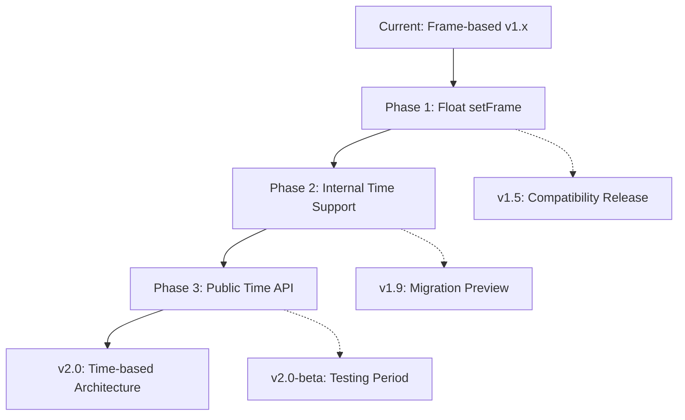

# ofxAEPlayer v2.0 Time-Based Architecture Migration Roadmap

## Executive Summary

このドキュメントは、ofxAEPlayer をフレームベースから時間ベースのアーキテクチャへ移行するための詳細なロードマップです。段階的な移行により、既存ユーザーへの影響を最小限に抑えつつ、長期的に保守可能で拡張性の高いシステムを実現します。

**目標:** フレーム補間の根本的な解決と、AE の時間ベースモデルへの完全な準拠

---

## Migration Strategy Overview



---

## Phase 1: Float setFrame Implementation (v1.5)

### Timeline: 3-4 weeks

### Objectives
- 15fps/30fps 補間問題の即座の解決
- 後方互換性の完全な維持
- v2.0 への移行基盤の構築

### Implementation Tasks

#### 1.1 Core Infrastructure (Week 1)

**Task 1.1.1: Property System Float Support**
- File: [`src/prop/ofxAEProperty.h`](src/prop/ofxAEProperty.h)
- Changes:
  ```cpp
  class PropertyBase {
  public:
      virtual bool setFrame(int frame) { return setFrame(static_cast<float>(frame)); }
      virtual bool setFrame(float frame) { return false; }
  };
  
  template<typename T>
  class Property : public PropertyBase {
  public:
      bool setFrame(float frame) override;
  private:
      // Internal frame tracking
      float last_frame_ = -1.0f;
  };
  ```

**Task 1.1.2: Keyframe Utilities Float Support**
- File: [`src/prop/ofxAEKeyframe.h`](src/prop/ofxAEKeyframe.h:176)
- Changes:
  ```cpp
  template<typename T>
  struct KeyframePair {
      const Keyframe::Data<T>* keyframe_a = nullptr;
      const Keyframe::Data<T>* keyframe_b = nullptr;
      float ratio = 0.0f;
      int frame_a = 0;
      int frame_b = 0;
  };
  
  template<typename T>
  KeyframePair<T> findKeyframePair(
      const std::map<int, Keyframe::Data<T>>& keyframes, 
      float frame);  // float parameter
  ```

#### 1.2 Composition & Layer (Week 2)

**Task 1.2.1: Composition Float Frame**
- File: [`src/core/ofxAEComposition.h`](src/core/ofxAEComposition.h)
- Changes:
  ```cpp
  class Composition {
  public:
      bool setFrame(int frame) { return setFrame(static_cast<float>(frame)); }
      bool setFrame(float frame);
      
      float getCurrentFrame() const { return current_frame_; }
      
  private:
      float current_frame_ = 0.0f;  // Changed from int
  };
  ```

**Task 1.2.2: Layer Float Frame**
- File: [`src/core/ofxAELayer.h`](src/core/ofxAELayer.h)
- Similar changes to Composition

#### 1.3 Source System (Week 2-3)

**Task 1.3.1: LayerSource Interface**
- File: [`src/source/ofxAELayerSource.h`](src/source/ofxAELayerSource.h:26)
- Add `virtual bool setFrame(float frame)`

**Task 1.3.2: All Source Implementations**
- [`CompositionSource`](src/source/ofxAECompositionSource.h)
- [`VideoSource`](src/source/ofxAEVideoSource.h)
- [`SequenceSource`](src/source/ofxAESequenceSource.h)
- [`ShapeSource`](src/source/ofxAEShapeSource.h)

#### 1.4 Player & Testing (Week 3-4)

**Task 1.4.1: Player Float Support**
- File: [`src/ofxAEPlayer.h`](src/ofxAEPlayer.h)
- Changes:
  ```cpp
  class Player {
  public:
      void setFrame(int frame) { setFrame(static_cast<float>(frame)); }
      void setFrame(float frame);
      float getCurrentFrame() const { return target_frame_; }
      
  private:
      float target_frame_ = 0.0f;
  };
  ```

**Task 1.4.2: Unit Tests**
- Test float frame interpolation
- Test backward compatibility
- Performance benchmarks

### Deliverables
- ✅ Float setFrame API (backward compatible)
- ✅ 15fps/30fps smooth interpolation
- ✅ All existing tests passing
- ✅ Migration guide for v1.5

---

## Phase 2: Internal Time Architecture (v1.9)

### Timeline: 6-8 weeks

### Objectives
- 内部的に時間ベースのデータ構造を導入
- 既存の Frame API は互換レイヤーとして維持
- Time API のプレビュー版を提供

### Implementation Tasks

#### 2.1 Time-Based Keyframe Storage (Week 1-2)

**Task 2.1.1: Dual Storage Strategy**
- File: New `src/prop/ofxAETimeProperty.h`
- Strategy:
  ```cpp
  template<typename T>
  class TimeProperty : public PropertyBase {
  public:
      // Public API: both frame and time
      bool setFrame(float frame) override;
      bool setTime(double time);
      
      T getValue() const;
      
  private:
      // Internal: time-based storage
      std::map<double, Keyframe::Data<T>> keyframes_time_;
      double fps_ = 30.0;
      
      // Cache for frame-based access
      std::optional<T> cache_;
      double last_time_ = -1.0;
  };
  ```

**Task 2.1.2: JSON Import/Export**
- Support both formats:
  ```json
  // Frame-based (legacy)
  {
    "keyframes": {
      "30": [{"value": 100}],
      "60": [{"value": 200}]
    }
  }
  
  // Time-based (new)
  {
    "keyframes_time": {
      "1.0": [{"value": 100}],
      "2.0": [{"value": 200}]
    },
    "fps": 30
  }
  ```

#### 2.2 Time-Based Composition (Week 3-4)

**Task 2.2.1: Composition Time Support**
- File: [`src/core/ofxAEComposition.h`](src/core/ofxAEComposition.h)
- Changes:
  ```cpp
  class Composition {
  public:
      // Frame API (compatibility layer)
      bool setFrame(int frame) { return setFrame(static_cast<float>(frame)); }
      bool setFrame(float frame) { return setTime(frame / info_.fps); }
      float getCurrentFrame() const { return static_cast<float>(current_time_ * info_.fps); }
      
      // Time API (new)
      bool setTime(double time);
      double getTime() const { return current_time_; }
      
  private:
      double current_time_ = 0.0;  // Primary time storage
      Info info_;
  };
  ```

**Task 2.2.2: Layer Time Support**
- Similar changes to [`ofxAELayer`](src/core/ofxAELayer.h)

#### 2.3 AE Exporter Update (Week 5-6)

**Task 2.3.1: ExportComposition.jsx**
- File: [`tools/ExportComposition.jsx`](tools/ExportComposition.jsx)
- Add time export option:
  ```javascript
  // Export keyframes with time
  function exportKeyframeTime(property, comp) {
      var keyframes = {};
      for (var i = 1; i <= property.numKeys; i++) {
          var time = property.keyTime(i);  // seconds
          var value = property.keyValue(i);
          keyframes[time.toFixed(6)] = [formatValue(value)];
      }
      return {
          keyframes_time: keyframes,
          fps: comp.frameRate
      };
  }
  ```

#### 2.4 Preview & Testing (Week 7-8)

**Task 2.4.1: Migration Preview Mode**
- Add compile-time flag:
  ```cpp
  #ifdef OFX_AE_USE_TIME_API
      // Use time-based API
  #else
      // Use frame-based API (default)
  #endif
  ```

**Task 2.4.2: Comprehensive Testing**
- Dual API compatibility tests
- Time/Frame conversion accuracy
- Performance comparison

### Deliverables
- ✅ Internal time-based architecture
- ✅ Frame API compatibility layer
- ✅ Time API preview (opt-in)
- ✅ Updated AE exporter with time support
- ⚠️ Deprecation warnings for frame-only usage

---

## Phase 3: Public Time API Transition (v2.0-beta)

### Timeline: 4-6 weeks

### Objectives
- Time API を公式インターフェースとして確立
- Frame API は非推奨だが完全にサポート
- ユーザーへの移行ガイド提供

### Implementation Tasks

#### 3.1 API Documentation (Week 1-2)

**Task 3.1.1: Migration Guide**
- Create `docs/MIGRATION_V2.md`:
  ```markdown
  # Migration Guide: v1.x → v2.0
  
  ## What's Changed
  - Primary API is now time-based (seconds)
  - Frame API is deprecated but fully supported
  
  ## Migration Steps
  
  ### Before (v1.x):
  ```cpp
  composition.setFrame(30);
  int frame = composition.getCurrentFrame();
  ```
  
  ### After (v2.0):
  ```cpp
  composition.setTime(1.0);  // 1 second
  double time = composition.getTime();
  
  // Frame API still works (deprecated):
  composition.setFrame(30);  // internally converted to time
  ```
  ```

**Task 3.1.2: API Reference**
- Full documentation of time-based API
- Conversion utilities documentation
- Best practices guide

#### 3.2 Deprecation Strategy (Week 2-3)

**Task 3.2.1: Deprecation Attributes**
```cpp
class Composition {
public:
    // New primary API
    bool setTime(double time);
    double getTime() const;
    
    // Deprecated but supported
    [[deprecated("Use setTime() instead. frame will be converted to time.")]]
    bool setFrame(int frame);
    
    [[deprecated("Use getTime() instead. Returns time * fps.")]]
    float getCurrentFrame() const;
};
```

**Task 3.2.2: Runtime Warnings**
```cpp
bool Composition::setFrame(int frame) {
    #ifdef OFX_AE_WARN_DEPRECATED
        ofLogWarning("ofxAEComposition") 
            << "setFrame() is deprecated. Use setTime() instead.";
    #endif
    return setTime(static_cast<double>(frame) / info_.fps);
}
```

#### 3.3 Example Updates (Week 3-4)

**Task 3.3.1: Update All Examples**
- [`example/src/ofApp.cpp`](example/src/ofApp.cpp)
- `example-collision/src/ofApp.cpp`
- `example-marker/src/ofApp.cpp`

**Task 3.3.2: Create Time-Based Examples**
```cpp
// example-time/src/ofApp.cpp
void ofApp::update() {
    double elapsed = ofGetElapsedTimef();
    double comp_time = fmod(elapsed * speed_, composition.getDuration());
    composition.setTime(comp_time);
    composition.update();
}

void ofApp::seekToMarker(const std::string& name) {
    auto marker = composition.findMarker(name);
    if (marker) {
        composition.setTime(marker->time);  // Direct time access
    }
}
```

#### 3.4 Beta Testing Period (Week 5-6)

**Task 3.4.1: Beta Release**
- Release v2.0-beta
- Gather user feedback
- Monitor deprecation warnings in real projects

**Task 3.4.2: Performance Validation**
- Benchmark time-based vs frame-based
- Memory usage comparison
- Real-world project testing

### Deliverables
- ✅ Complete migration documentation
- ✅ Deprecation warnings system
- ✅ Updated examples (time-based)
- ✅ Beta release for user testing
- ✅ Performance validation report

---

## Phase 4: v2.0 Final Release

### Timeline: 2-3 weeks

### Objectives
- 正式リリース
- 完全なドキュメント
- コミュニティサポート体制

### Tasks

#### 4.1 Final Polish (Week 1)

**Task 4.1.1: Bug Fixes from Beta**
- Address all beta feedback
- Fix edge cases
- Performance optimizations

**Task 4.1.2: Documentation Completion**
- API reference完成
- チュートリアル動画（オプション）
- FAQ section

#### 4.2 Release Preparation (Week 2)

**Task 4.2.1: Version Management**
- Tag v2.0.0
- Release notes
- Breaking changes summary

**Task 4.2.2: Community Communication**
- Blog post / announcement
- Migration webinar (optional)
- Discord/Forum support

#### 4.3 Long-Term Support (Week 3+)

**Task 4.3.1: Dual Version Support**
- v1.x: maintenance mode (bug fixes only)
- v2.0: active development

**Task 4.3.2: Automated Migration Tool (Optional)**
```cpp
// tools/migrate_to_v2.py
"""
Automated migration tool for v1.x → v2.0

Converts:
- setFrame(n) → setTime(n / fps)
- getCurrentFrame() → getTime() * fps
"""
```

### Deliverables
- ✅ v2.0 final release
- ✅ Complete documentation
- ✅ Migration support tools
- ✅ Community engagement

---

## Technical Specifications

### Time Precision

```cpp
// Internal time representation
using TimeValue = double;  // seconds, double precision

constexpr double TIME_EPSILON = 1e-6;  // 1 microsecond

inline bool isNearTime(double a, double b) {
    return std::abs(a - b) < TIME_EPSILON;
}
```

### Frame/Time Conversion

```cpp
namespace ofx { namespace ae { namespace util {

struct FrameTimeConverter {
    double fps;
    
    double frameToTime(float frame) const {
        return static_cast<double>(frame) / fps;
    }
    
    float timeToFrame(double time) const {
        return static_cast<float>(time * fps);
    }
    
    int timeToFrameInt(double time) const {
        return static_cast<int>(std::round(time * fps));
    }
};

}}}
```

### Keyframe Storage Migration

```cpp
// Migration utility
template<typename T>
std::map<double, Keyframe::Data<T>> convertKeyframesToTime(
    const std::map<int, Keyframe::Data<T>>& frame_keyframes,
    double fps)
{
    std::map<double, Keyframe::Data<T>> time_keyframes;
    for (const auto& [frame, kf] : frame_keyframes) {
        double time = static_cast<double>(frame) / fps;
        time_keyframes[time] = kf;
    }
    return time_keyframes;
}
```

---

## Compatibility Matrix

| Version | Frame API | Time API | JSON Format | Exporter |
|---------|-----------|----------|-------------|----------|
| v1.4 (current) | ✅ int only | ❌ | Frame-based | Frame export |
| v1.5 | ✅ int + float | ❌ | Frame-based | Frame export |
| v1.9 | ✅ Deprecated | ✅ Preview | Both (dual) | Both modes |
| v2.0-beta | ⚠️ Deprecated | ✅ Primary | Time (frame compat) | Time export |
| v2.0 | ⚠️ Deprecated | ✅ Primary | Time-based | Time export |

---

## Risk Mitigation

### Risk 1: Performance Regression
**Mitigation:**
- Extensive benchmarking in each phase
- Cache optimization for time↔frame conversion
- Profile-guided optimization

### Risk 2: User Adoption Resistance
**Mitigation:**
- Long deprecation period (v1.9 → v2.0 → v2.1)
- Excellent migration documentation
- Active community support
- Automated migration tools

### Risk 3: Third-Party Integration Breakage
**Mitigation:**
- Backward compatibility layer
- Clear communication to addon developers
- Test with popular addons (ofxTimeline, etc.)

### Risk 4: JSON Format Incompatibility
**Mitigation:**
- Support both formats simultaneously
- Automatic format detection
- Conversion utility tool

---

## Success Metrics

### Phase 1 (v1.5)
- ✅ 15fps/30fps interpolation works smoothly
- ✅ Zero regression in existing projects
- ✅ Performance within 5% of v1.4

### Phase 2 (v1.9)
- ✅ 50%+ of internal code uses time-based architecture
- ✅ Time API preview used by early adopters
- ✅ No critical bugs in dual-API mode

### Phase 3 (v2.0-beta)
- ✅ 80%+ of beta testers successfully migrate
- ✅ Documentation rated 4+/5 by users
- ✅ <10 critical issues reported

### Phase 4 (v2.0)
- ✅ 100% of examples updated
- ✅ >90% test coverage
- ✅ Community adoption within 6 months

---

## Timeline Summary

```
Year 1:
├─ Q1: Phase 1 (v1.5) - Float setFrame
├─ Q2: Phase 2 Start (v1.9 dev)
├─ Q3: Phase 2 Complete + Phase 3 Start (v2.0-beta)
└─ Q4: Phase 3 Complete + Phase 4 (v2.0 release)

Year 2:
├─ Q1-Q2: v2.0 refinement + migration support
├─ Q3: v1.x maintenance end
└─ Q4: v2.1 with time-based optimizations
```

**Total Duration:** 12-15 months from start to v2.0 final

---

## Conclusion

この段階的なアプローチにより:

1. **即座の問題解決** - Phase 1 で 15fps/30fps 補間問題を解決
2. **リスク最小化** - 各フェーズで段階的に検証
3. **ユーザーフレンドリー** - 十分な移行期間と手厚いサポート
4. **長期的な利点** - 時間ベースの正確で拡張性の高いアーキテクチャ

v2.0 リリース後は、可変フレームレート、タイムリマップ、オーディオ同期などの高度な機能が自然に実装できるようになります。